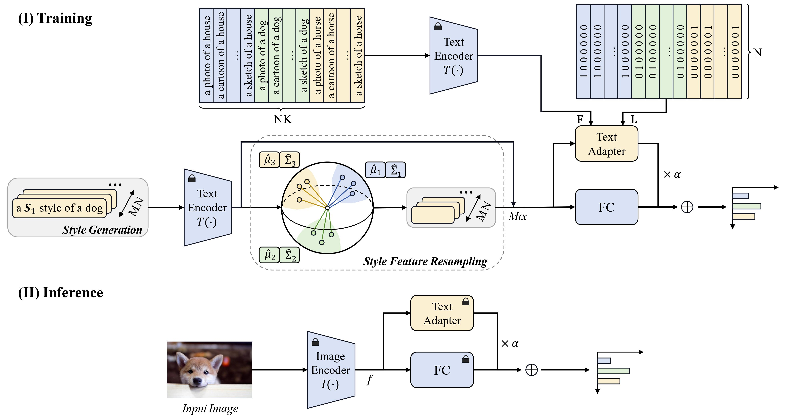

# PromptTA: Prompt-driven Text Adapter for Source-free Domain Generalization [ICASSP 2025 under review]


<!-- [arXiv](https://arxiv.org/abs/2312.09553v2) -->


Authors: Haoran Zhang, [Shuanghao Bai](https://baishuanghao.github.io/), [Wanqi Zhou](https://scholar.google.com/citations?user=3Q_3PR8AAAAJ&hl=zh-CN), [Jingwen Fu](https://scholar.google.com/citations?hl=zh-CN&user=2Cu9uMUAAAAJ), [Badong Chen](https://scholar.google.com/citations?user=mq6tPX4AAAAJ&hl=zh-CN&oi=ao).


## Highlights


> **<p align="justify"> Abstract:** *Source-free domain generalization (SFDG) tackles the challenge of adapting models to unseen target domains without access to source domain data. 
To deal with this challenging task, recent advances in SFDG have primarily focused on leveraging the text modality of vision-language models such as CLIP. 
These methods involve developing a transferable linear classifier based on diverse style features extracted from the text and learned prompts or deriving domain-unified text representations from domain banks. 
However, both style features and domain banks have limitations in capturing comprehensive domain knowledge.
In this work, we propose Prompt-Driven Text Adapter (PromptTA) method, which is designed to better capture the distribution of style features and employ resampling to ensure thorough coverage of domain knowledge. 
To further leverage this rich domain information, we introduce a text adapter that learns from these style features for efficient domain information storage.
Extensive experiments conducted on four benchmark datasets demonstrate that PromptTA achieves state-of-the-art performance.* </p>

<details>
  
<summary>Main Contributions</summary>

1) We propose PromptTA, a novel adapter-based framework for SFDG that incorporates a text adapter to effectively leverage rich domain information.
2) We introduce style feature resampling that ensures comprehensive coverage of textual domain knowledge.
3) Extensive experiments demonstrate that our PromptTA achieves the state of the art on DG benchmarks.
   
</details>


## Installation 
For installation and other package requirements, please follow the instructions as follows. 
This codebase is tested on Ubuntu 20.04 LTS with python 3.7. Follow the below steps to create environment and install dependencies.

* Setup conda environment.
```bash
# Create a conda environment
conda create -y -n prompt_ta python=3.7

# Activate the environment
conda activate prompt_ta

# Install torch (requires version >= 1.8.1) and torchvision
# Please refer to https://pytorch.org/get-started/previous-versions/ if your cuda version is different
conda install pytorch==1.12.0 torchvision==0.13.0 torchaudio==0.12.0 cudatoolkit=11.3 -c pytorch
```

* Install dassl library.
```bash
# Instructions borrowed from https://github.com/KaiyangZhou/Dassl.pytorch#installation

# Clone this repo
git clone https://github.com/KaiyangZhou/Dassl.pytorch.git
cd Dassl.pytorch

# Install dependencies
pip install -r requirements.txt

# Install dassl library (no need to re-build if the source code is modified)
python setup.py develop
cd ..
```

* Install clip library.
```bash
# Dependencies, may have been installed in former steps
pip install ftfy regex tqdm

# Install clip library from git
pip install git+https://github.com/openai/CLIP.git
```

* Clone PromptTA code repository and install requirements.
```bash
# Clone PromptTA code base
git clone https://github.com/zhanghr2001/PromptTA.git
cd PromptTA

# Install requirements
pip install -r requirements.txt
```

## Data Preparation
Download datasets and modify dataset path in .sh files to your path.
Datasets list:
- [PACS](https://drive.google.com/uc?id=1m4X4fROCCXMO0lRLrr6Zz9Vb3974NWhE)
- [VLCS](http://www.mediafire.com/file/7yv132lgn1v267r/vlcs.tar.gz/file)
- [OfficeHome](https://drive.google.com/file/d/0B81rNlvomiwed0V1YUxQdC1uOTg/view?pli=1&resourcekey=0-2SNWq0CDAuWOBRRBL7ZZsw)
- [DomainNet](http://ai.bu.edu/DomainNet/)


## Training and Evaluation
Train and evaluate by running [scripts](scripts/), folder names represent methods.

```bash
# Example: train and evaluate on PACS dataset, with backbone ResNet-50 and GPU 0
bash scripts/prompt_ta/main_ta_all.sh pacs b128_ep50_pacs RN50 0
```


<!-- ## Citation
If our code is helpful to your research or projects, please consider citing:
```bibtex
@inproceedings{bai2024prompt,
  title={Prompt-based distribution alignment for unsupervised domain adaptation},
  author={Bai, Shuanghao and Zhang, Min and Zhou, Wanqi and Huang, Siteng and Luan, Zhirong and Wang, Donglin and Chen, Badong},
  booktitle={Proceedings of the AAAI Conference on Artificial Intelligence},
  volume={38},
  number={2},
  pages={729--737},
  year={2024}
}
``` -->


## Acknowledgements

Our style of readme refers to [PDA](https://github.com/BaiShuanghao/Prompt-based-Distribution-Alignment). 
And our code is based on [CoOp](https://github.com/KaiyangZhou/CoOp) and [PromptStyler](https://arxiv.org/abs/2307.15199). We thank the authors for their great work.